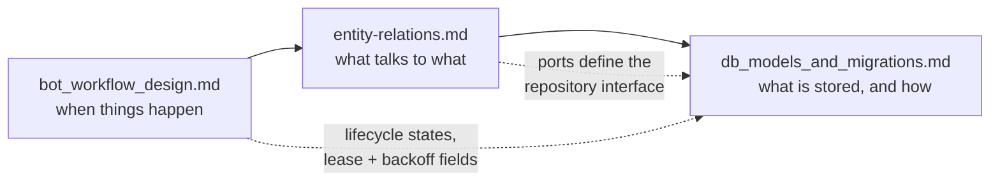

# Backend Architecture

Entry point for the PR Review bot's design documentation. This file is a map — each
section says what a document covers and when you need it. The detail lives in the
linked documents, not here.

**Status:** design-first. The documents below are the specification; no
implementation exists yet, so schema and workflow decisions are still cheap to
change.

---

## What the system does

A GitHub App that reviews pull requests with an LLM and posts the results back to
GitHub. It re-reviews a PR on **every update to its head**, which is the
requirement that shapes most of the design: the same PR is reviewed many times, so
duplicate work and duplicate comments are the central problems to solve rather than
edge cases.

Two processes on a VPS:

| Process | Responsibility |
| :--- | :--- |
| **API** | Receive webhooks, verify signatures, enqueue jobs. No network I/O beyond the database — must answer inside GitHub's ~10s delivery timeout. |
| **Worker** | Claim jobs, fetch diffs, run the review, post feedback. Long-running; deliberately separate so API deploys never abandon an in-flight review. |

They share a PostgreSQL database, which is both the **work queue** and the **audit
log**.

---

## Committed decisions

| Decision | Choice | Rationale lives in |
| :--- | :--- | :--- |
| Trigger | `pull_request` events (`opened`, `synchronize`, `reopened`, `ready_for_review`) | [bot_workflow_design.md §2](./bot_workflow_design.md) |
| Queue | PostgreSQL `FOR UPDATE SKIP LOCKED` — no Redis, no Celery | [bot_workflow_design.md §1](./bot_workflow_design.md) |
| Runtime | Async throughout: FastAPI, SQLAlchemy 2.0 async, asyncpg, httpx | [db_models_and_migrations.md §2](./db_models_and_migrations.md) |
| Structure | Ports and adapters, dependencies pointing inward | [entity-relations.md §1](./entity-relations.md) |
| Feedback | Check Run updated in place + fingerprinted inline comments | [bot_workflow_design.md §5](./bot_workflow_design.md) |

---

## Document map

### [`bot_workflow_design.md`](./bot_workflow_design.md)

**The runtime behaviour.** What happens between a developer pushing to a PR branch
and a comment appearing on GitHub.

Covers the architecture diagram, the event filter and skip rules, the enqueue
transaction, the worker claim protocol, authentication (App JWT → installation
token), the job lifecycle state machine, error classification and retries, VPS
deployment, and rate-limit/cost controls.

Read this first, and read §4–§6 before touching anything near the queue — they
carry the three problems that repeat reviews create:

* **§4 Idempotency** — why there are two layers, and why `(repo_id, pr_number,
  head_sha)` is deliberately *not* a unique constraint.
* **§5 Repeat reviews** — how a PR reviewed five times avoids carrying five copies
  of every finding.
* **§6 Failure handling** — lease expiry and the reaper, which is the only path
  that can recover a job from a dead worker.

### [`entity-relations.md`](./entity-relations.md)

**The structure.** Two diagrams that were previously conflated into one:

1. **Component architecture** — driving adapters, domain core, ports, driven
   adapters, and the rule that the domain imports nothing from `adapters/`. Also
   states what the domain entities are expected to *do*, which is the test of
   whether the mapping layer earns its cost.
2. **Entity-relationship model** — the two persisted tables, a field-by-field
   justification, and a "deliberately absent" section explaining why there is no
   `repositories` or `pull_requests` table.

Read this before adding a dependency, a table, or a new outbound integration.

### [`db_models_and_migrations.md`](./db_models_and_migrations.md)

**The persistence layer.** SQLAlchemy 2.0 async models, engine and session setup,
the async Alembic `env.py` (the default template is synchronous and will not work),
the initial migration, and a query reference for the three load-bearing SQL
statements: enqueue-with-supersession, claim, and reap.

Read §5 (Query Reference) before writing any code that touches job state — those
statements are single-statement by design, and splitting one into a read followed
by a write reintroduces the races they exist to prevent.

---

## How the pieces connect



The workflow document is the source of truth for behaviour; the schema exists to
serve it. Where they disagree, the workflow document wins and the schema is wrong.

---

## Planned code layout

Derived from the component diagram — not yet implemented.

```
domain/            # No framework imports, no I/O. Pure Python.
  models.py        #   ReviewJob, ReviewComment, ReviewStatus, Finding
  ports.py         #   Protocols: JobRepository, LLMGateway, GitProvider, Clock
  service.py       #   ReviewService — orchestrates the workflow

adapters/
  db/
    models.py      #   ReviewJobORM, ReviewCommentORM
    repository.py  #   PostgresJobRepository — implements JobRepositoryPort
    session.py     #   async engine + sessionmaker
  github/          #   GitHubAdapter: App JWT auth, diff fetch, comment posting
  llm/             #   LLM gateway adapter

api/
  webhooks.py      #   POST /webhooks/github — signature verification + enqueue
  admin.py         #   job status, manual re-run
  main.py          #   FastAPI app factory

worker/
  loop.py          #   claim / LISTEN / poll fallback
  reaper.py        #   expired-lease recovery

alembic/
  env.py           #   async migration runner
  versions/
    0001_initial_schema.py
```

The direction of every import is the invariant worth enforcing in review:
`adapters/` and `api/` may import `domain/`; `domain/` may import neither.

---

## Open questions

Tracked in [bot_workflow_design.md §10](./bot_workflow_design.md): draft-PR
handling, whether findings carry a severity (the only one that touches the schema),
whether a review can fail the Check Run and block merge, and data retention on app
uninstall.

---

*This file lives in `docs/` alongside the documents it indexes. If it should be the
repository entry point instead, move it to the root and adjust the relative links
to `docs/...`.*
