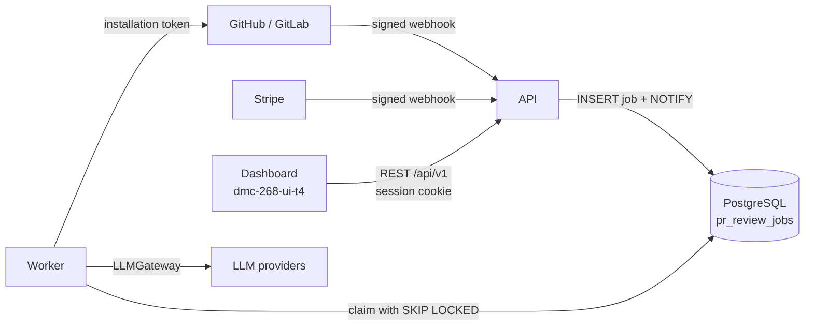
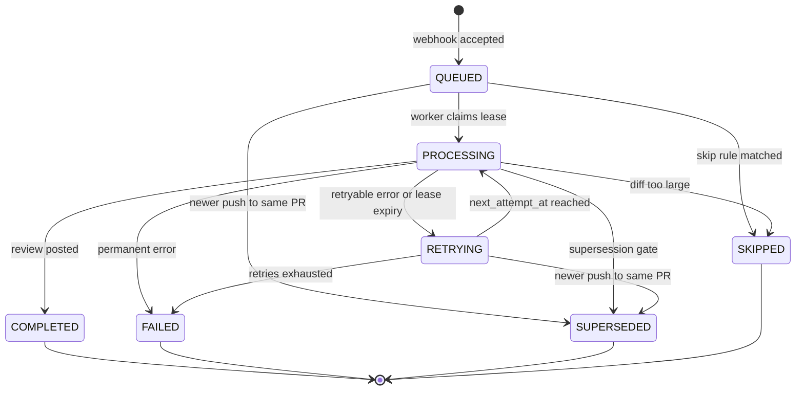

# Pipeline & Contracts Specification

Three processes have to agree on the same vocabulary: the **API** accepts webhooks and
serves the dashboard, the **worker** runs reviews, and the **dashboard** displays them.
This document is the contract between them. Where it states a shape or a name, that name
is binding on all three.

Two companion artifacts carry the machine-readable half:

| Artifact | Contract |
| :--- | :--- |
| [`openapi.yaml`](./openapi.yaml) | every HTTP endpoint the dashboard calls |
| [`schemas/llm-output.schema.json`](./schemas/llm-output.schema.json) | the JSON the model must return |

Behaviour is specified in [WORKFLOW_DESIGN.md](./WORKFLOW_DESIGN.md) and stays there;
this file adds only what crosses a boundary. Where the two disagree on behaviour, the
workflow document wins.

**Decisions this document proposes** are marked **[D1]**–**[D6]** and listed in
[§9](#9-decisions-this-document-asks-for). They exist because the contract cannot be
written without resolving them.

---

## 1. Parties and boundaries



Three boundaries, three contracts:

| Boundary | Carrier | Contract |
| :--- | :--- | :--- |
| Dashboard → API | HTTPS, JSON | [`openapi.yaml`](./openapi.yaml) |
| API → worker | a row in `pr_review_jobs` plus `NOTIFY` | [§3](#3-queue-protocol-api--worker) |
| Worker → LLM | HTTPS, JSON | [`schemas/llm-output.schema.json`](./schemas/llm-output.schema.json) |

The forge and Stripe sides are inbound webhooks; their payloads are defined by the
provider, not by us, and are parsed in the adapter ([WORKFLOW_DESIGN.md §2](./WORKFLOW_DESIGN.md)).

---

## 2. Job state machine

**The status set is the one already in the schema and the workflow document**
(`docs/db_models_and_migrations.md §1.1`, `WORKFLOW_DESIGN.md §7`), not the stage names
from the issue. **[D1]**

| Status | Terminal | Meaning for the dashboard |
| :--- | :--- | :--- |
| `QUEUED` | no | Accepted, waiting for a worker |
| `PROCESSING` | no | A worker holds a lease and is working through the steps |
| `RETRYING` | no | A retryable failure; waiting for `next_attempt_at` |
| `COMPLETED` | yes | Review posted to the pull request |
| `FAILED` | yes | Permanent failure or retries exhausted; `error_kind` says why |
| `SUPERSEDED` | yes | A newer push to the same pull request replaced this job |
| `SKIPPED` | yes | A skip rule matched; `error_kind` says which |



**Who may write what.** Only the worker writes `PROCESSING`, `COMPLETED`, `RETRYING` and
`FAILED`. Only the ingest path writes `SUPERSEDED`. Either may write `SKIPPED`, depending
on where the rule fires. Terminal states are never re-entered: a re-run inserts a **new**
job and returns its id.

### 2.1 Steps inside `PROCESSING`

The issue names `FETCHING_DIFF`, `PARSING_CONTEXT` and `LLM_PROCESSING`. Those are not
statuses — they are **steps within `PROCESSING`**, already modelled as `pr_review_steps`
rows. Keeping them out of `status` is what makes the status set small enough to reason
about, while the step rows give the dashboard a timeline and the team a latency
breakdown.

| Step | Issue name | What must be true when it ends `OK` |
| :--- | :--- | :--- |
| `CLAIMED` | — | Lease held, `config_digest` resolved |
| `AUTH` | — | A usable forge token was minted |
| `FETCH_DIFF` | `FETCHING_DIFF` | Diff and PR metadata fetched |
| `BUILD_CONTEXT` | `PARSING_CONTEXT` | Context assembled within the token budget |
| `REDACT` | — | Secrets replaced; a report exists |
| `GATE` | — | Still newest for this PR, and quota allows the spend |
| `LLM_CALL` | `LLM_PROCESSING` | A reply arrived from some provider |
| `POSTPROCESS` | — | Reply parsed, invalid findings dropped, duplicates removed |
| `POST_FEEDBACK` | — | Comments and the summary are on the pull request |
| `METER` | — | Usage recorded for the billing period |

Each step row carries `status` (`RUNNING`, `OK`, `FAILED`, `SKIPPED`), `started_at`,
`finished_at`, `error_kind` and a `metrics` object of **counts and digests only** — never
diff text, prompt or model reply.

**The dashboard reads steps**, and `GET /v1/jobs/{job_id}` returns them. Without them a
slow review is indistinguishable from a stuck one. **[D2]**

---

## 3. Queue protocol (API → worker)

The queue is the `pr_review_jobs` table; there is no broker
([WORKFLOW_DESIGN.md §1](./WORKFLOW_DESIGN.md)).

| Property | Contract |
| :--- | :--- |
| Enqueue | One transaction: supersede active jobs for the same PR, insert the new row as `QUEUED`, `NOTIFY`. No network I/O, so the forge gets `202` inside its delivery timeout |
| Claim | `SELECT ... FOR UPDATE SKIP LOCKED` on `QUEUED`/`RETRYING` where `next_attempt_at <= now()`, bounded by `max_in_flight_per_account` |
| Lease | `locked_by` + `locked_until`, **10 minutes**, renewed by long reviews. The lease, not the row lock, is what protects a job across the LLM call |
| Recovery | The reaper moves `PROCESSING` jobs with an expired lease to `RETRYING`, `retry_count + 1`, `error_kind = 'lease_expired'` |
| Idempotency | `UNIQUE (provider, delivery_id)`; a redelivered webhook inserts nothing. A manual re-run has `delivery_id = NULL`, which the unique constraint permits |
| Ordering | Not guaranteed and not required: supersession, not ordering, is what makes a double push cost one review |

A job row is also the audit record, so a worker must never delete one — it writes a
terminal status instead.

---

## 4. Timeouts, retries and backoff

### 4.1 Timeouts

| Operation | Timeout | Source |
| :--- | :--- | :--- |
| Webhook handling (API) | under the forge delivery timeout (~10 s) | [BACKEND_ARCHITECTURE.md § Processes](./BACKEND_ARCHITECTURE.md) |
| One LLM HTTP request | `LLM_TIMEOUT_SECONDS`, default **120 s** | [llm-gateway.md](./llm-gateway.md) |
| Forge REST call | **30 s** per request |  this document |
| Whole job | bounded by the lease: **10 min** per attempt, renewed while progressing | [WORKFLOW_DESIGN.md §6](./WORKFLOW_DESIGN.md) |

### 4.2 Error classes

| Class | Examples | Effect |
| :--- | :--- | :--- |
| `retryable` | 429, 5xx, LLM timeout, connection reset, expired lease | `RETRYING` with backoff |
| `permanent` | 404 (PR deleted), 401/403 (app uninstalled, token revoked), malformed diff, invalid LLM output after the corrective retry | `FAILED` immediately |
| `exhausted` | `retry_count >= max_retries` (default **3**) | `FAILED`, alert |

### 4.3 Backoff

`next_attempt_at = now() + min(60s * 2^retry_count, 15min) ± jitter(20%)`, giving roughly
1, 2 and 4 minutes for the three attempts. Jitter exists so that a provider outage does
not produce a synchronised retry storm when it ends.

Two rules that override the formula:

- a `429` that carries `Retry-After` uses that value when it is larger;
- a job whose PR has been superseded is not retried at all — it terminates `SUPERSEDED`.

### 4.4 LLM-specific behaviour

The gateway already implements this ([llm-gateway.md](./llm-gateway.md), PR #8); the
contract fixes what the rest of the system may assume:

| Situation | Behaviour |
| :--- | :--- |
| `429` from the provider | The key cools down for `Retry-After`, or 60 s; the next key is used |
| `401`/`403` from the provider | That key is disabled until restart |
| No key is usable | `ProviderUnavailableError` → the next provider |
| Every provider failed | `AllProvidersFailedError` → job `RETRYING`, `error_kind = 'provider_unavailable'` |
| Reply is not JSON | One corrective retry asking for JSON only; then `llm_output_invalid` |
| Reply is JSON but some findings are invalid | Those findings are dropped; the rest are posted |

---

## 5. Error vocabulary

`error_kind` is a closed set, at most 32 characters, written on the job and repeated on
the failing step. **The dashboard maps it to a human sentence**, so a new value is a
contract change, not an implementation detail.

| `error_kind` | Class | Status | What the dashboard says |
| :--- | :--- | :--- | :--- |
| `provider_unavailable` | retryable | `RETRYING` → `FAILED` | The model is temporarily unavailable; the review will be retried |
| `llm_output_invalid` | permanent | `FAILED` | The model returned an unusable answer |
| `forge_unavailable` | retryable | `RETRYING` | GitHub or GitLab is not responding |
| `lease_expired` | retryable | `RETRYING` | The review was interrupted and restarted |
| `credential_revoked` | permanent | `FAILED` | The access token was revoked; reconnect the integration |
| `installation_removed` | permanent | `FAILED` | The app was uninstalled |
| `installation_suspended` | permanent | `FAILED` | Access to the app is suspended |
| `subscription_inactive` | permanent | `SKIPPED` | The subscription does not allow reviews |
| `quota_exhausted` | permanent | `SKIPPED` | The period quota is used up |
| `pr_not_found` | permanent | `FAILED` | The pull request no longer exists |
| `internal_error` | permanent | `FAILED` | Something broke on our side |
| `skip_bot_author` | — | `SKIPPED` | The pull request was opened by a bot |
| `skip_draft` | — | `SKIPPED` | Draft pull requests are not reviewed |
| `skip_author_not_permitted` | — | `SKIPPED` | The author's standing is below the configured minimum |
| `skip_fork_pr` | — | `SKIPPED` | Pull requests from forks are not reviewed |
| `skip_author_rate_limited` | — | `SKIPPED` | The author reached the daily limit |
| `skip_diff_too_large` | — | `SKIPPED` | The diff is too large to review |
| `skip_no_reviewable_files` | — | `SKIPPED` | Only ignored files changed |

`error_log` is free text for triage, passed through the redactor. It is returned by the
API only to the account that owns the job, and never rendered as HTML by the dashboard.

---

## 6. LLM output contract

### 6.1 Schema

The model returns one JSON object. The strict schema is
[`schemas/llm-output.schema.json`](./schemas/llm-output.schema.json); it mirrors the
Pydantic models in `adapters/llm/schema.py` (PR #8) and the frontend type
`src/modules/runs/domain/finding.ts`.

```jsonc
{
  "summary": "Retries were added around the provider call. Two issues are worth a look.",
  "findings": [
    {
      "path": "src/payment_service.rb",
      "line": 142,
      "side": "new",                 // "old" = the pre-image, "new" = the post-image
      "severity": "high",            // critical | high | medium | low
      "category": "correctness",     // security | correctness | concurrency |
                                     // performance | maintainability
      "message": "The transaction stays open while the provider is retried…",
      "suggestion": {                // optional
        "before": ["    with_transaction do"],
        "after": ["    charge_with_retries(account, amount)"]
      }
    }
  ]
}
```

### 6.2 Validation

Validation is mandatory and happens before anything reaches a pull request
([AGENTS.md rule 5](../AGENTS.md)):

1. Strip a code fence if present, parse JSON. Not JSON → one corrective retry → `llm_output_invalid`.
2. Validate each finding against the schema. Invalid ones are **dropped**, not fixed.
3. Drop findings whose `(path, line, side)` is not part of this diff — a hallucinated
   position cannot become an inline comment.
4. Drop findings below `min_severity` for this repository.
5. Drop findings whose fingerprint was already posted on this pull request.

Steps 3–5 are why the count the dashboard shows can be lower than what the model
produced, and why `POSTPROCESS.metrics` records both numbers.

The schema is strict, the parser is tolerant in exactly one direction: unknown keys are
ignored rather than rejected, so a model that invents a field costs us the field and not
the finding. Every known field is validated as written.

### 6.3 `side`: one spelling

Three spellings exist today: `old`/`new` in the LLM schema and the frontend, `LEFT`/`RIGHT`
in `pr_review_comments`. **The wire format — LLM output and REST API alike — is
`old`/`new`.** **[D3]**

The reason is not taste: `LEFT`/`RIGHT` is GitHub's vocabulary, and GitLab has no such
field. A provider-neutral core should not speak one provider's dialect; the GitHub adapter
maps `old → LEFT` and `new → RIGHT` at the edge, where every other GitHub-specific
translation already lives.

---

## 7. What the dashboard needs, and why

The endpoints are specified in [`openapi.yaml`](./openapi.yaml). Four of them need
justification because they are additions to the surface in
[BACKEND_ARCHITECTURE.md § Public API](./BACKEND_ARCHITECTURE.md).

### 7.1 Severity and category must be stored **[D4]**

`configuration.md §3` treats severity as a filter threshold and drops it after filtering.
The dashboard shows a severity badge on every published finding and orders findings by it,
so dropping the value costs the console its most-used affordance: knowing what to read
first. The same applies to `category`, which exists in the domain model but has no column.

This does not weaken the retention rules. The prohibition covers **content** — diffs,
prompts, model replies. Severity is one enum value out of four, stored beside the comment
text that is already persisted.

Cost: two `VARCHAR(16)` columns on `pr_review_comments`, decided before the first
migration runs.

### 7.2 Pull request metadata must be stored **[D5]**

`pr_review_jobs` holds `repo_full_name`, `pr_number` and SHAs, but not the pull request
title, the author's login or the branch names. The list of reviews is unreadable without
them — `acme/payments #412` tells nobody what changed. All four values arrive in the same
webhook payload the job is created from, so storing them costs nothing at review time and
saves a forge round-trip per row afterwards.

### 7.3 A finding links to its published comment **[D5]**

`pr_review_comments.external_comment_id` identifies the comment, but the URL is built
differently on each forge. The API returns a ready `external_url`; assembling provider
URLs in the dashboard would put forge knowledge in the one place that should have none.

### 7.4 Diff context is computed, never stored **[D6]**

The dashboard renders each finding against the code it points at, with unfoldable context.
Storing diffs is a stated non-goal, and this proposal does not change that: two endpoints
**fetch from the forge on demand** and return without persisting anything.

| Endpoint | Returns |
| :--- | :--- |
| `GET /v1/jobs/{job_id}/findings/{finding_id}/context` | The hunks around the finding, plus the file's line count |
| `GET /v1/jobs/{job_id}/file-lines?path=&from=&to=` | A range of lines from the file at the reviewed revision |

Both need a live installation and a reachable SHA — the same limits the replay tool has
([BACKEND_ARCHITECTURE.md § Debugging a review](./BACKEND_ARCHITECTURE.md)) — so both may
answer `409 context_unavailable`, and the dashboard degrades to `path:line` plus a link to
the forge.

If the team rejects this, the diff viewer on the frontend has no data source, and the
console shows findings as plain text. That is a product decision, not a technical one.

---

## 8. Degradation

What the user sees when a dependency fails, in the order the pipeline meets them:

| Failure | System behaviour | Dashboard |
| :--- | :--- | :--- |
| Primary LLM provider down | Fallback provider; then `RETRYING` with backoff | Status "retrying", reason "model unavailable" |
| All providers down | `FAILED` after retries, `provider_unavailable` | Failed with an explanation and a re-run button |
| LLM returns nonsense | One corrective retry, then `FAILED` | Failed, `llm_output_invalid` |
| Some findings invalid | Valid ones are posted | Normal review; counts differ in step metrics |
| Forge 5xx | `RETRYING` | Status "retrying" |
| Forge 401/403 | `FAILED`, integration torn down | Installation marked broken, reconnect prompt |
| Quota exhausted | Job `SKIPPED`; the bot posts one announcement on the PR | Usage bar at 100%, link to billing |
| Subscription suspended | Jobs `SKIPPED` with `subscription_inactive` | Read-only console with a payment banner |
| Database down | Webhooks `5xx`: GitHub retries, **GitLab does not** — those deliveries are lost | Console unavailable |
| Worker dead | Lease expiry; the reaper requeues | Job stays "processing" up to 10 minutes, then retries |

Two properties of this table matter more than the rest: nothing silently disappears — every
terminal state has an `error_kind` — and the only invisible failure, ingest stopping, is
covered by a throughput alert rather than by the UI
([BACKEND_ARCHITECTURE.md § Observability](./BACKEND_ARCHITECTURE.md)).

---

## 9. Decisions this document asks for

| # | Decision | Affects | Cost if deferred |
| :--- | :--- | :--- | :--- |
| **D1** | Status set stays `QUEUED / PROCESSING / RETRYING / COMPLETED / FAILED / SUPERSEDED / SKIPPED`; the issue's stage names become step rows | migration `0001`, dashboard | Rewriting the migration and losing `SUPERSEDED` / `SKIPPED` |
| **D2** | `GET /jobs/{id}` returns step rows | API, dashboard timeline | A slow review looks identical to a stuck one |
| **D3** | `old`/`new` is the wire spelling for `side`; `LEFT`/`RIGHT` stays inside the GitHub adapter | LLM schema, API, DB column | Three spellings in one system |
| **D4** | Persist `severity` and `category` on a published finding | migration `0001`, dashboard | No badges, no ordering, no per-severity reporting |
| **D5** | Persist PR title, author login, head and base ref; return a ready `external_url` | migration `0001`, API | An unreadable review list and forge URL logic in the frontend |
| **D6** | Two on-demand endpoints serve diff context; nothing is stored | worker/API, dashboard | The diff viewer has no data source |

D1 is already the implemented design and needs only confirmation. D4 and D5 must be
settled **before migration `0001` is applied**, which
[BACKEND_ARCHITECTURE.md](./BACKEND_ARCHITECTURE.md) notes has not happened yet — after
that they become a migration rather than an edit.

---

## 10. Versioning and compatibility

- The REST prefix is `/api/v1`. Additive changes — a new field, a new endpoint, a new
  optional parameter — ship in `v1`. Removing or retyping a field is `v2`.
- `error_kind`, `status` and `step` are **closed sets**. Adding a value is an additive
  change, but the dashboard must render an unknown value as its raw string rather than
  crashing, so an unknown status never blanks a page.
- The LLM output schema is versioned with the prompt (`prompt_version`). A prompt that
  changes the shape of the output needs a new schema file, because old jobs must stay
  readable.
- This document and `openapi.yaml` change together. A pull request that changes one and
  not the other is incomplete.
