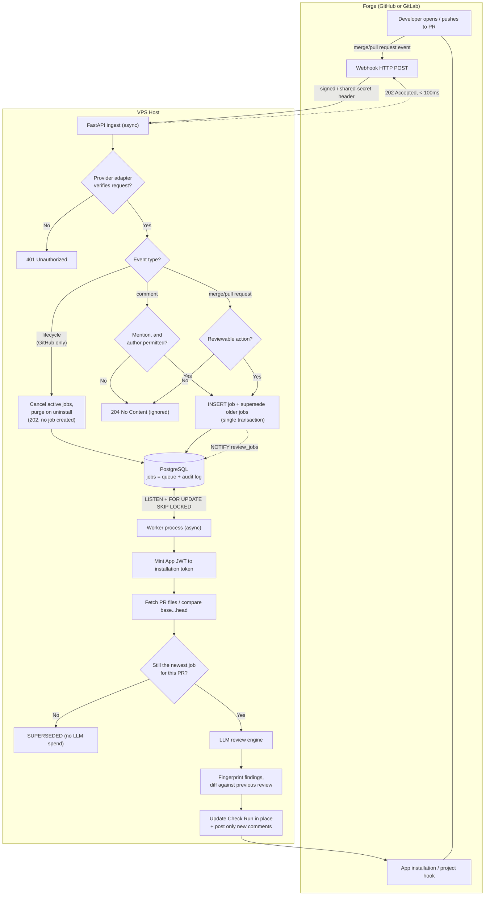
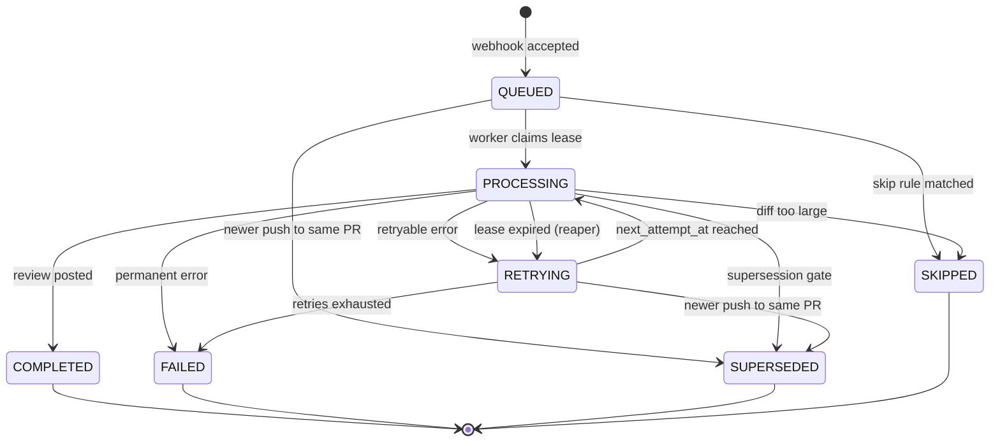

# Workflow Design: PR Review Bot

The runtime behaviour of the review pipeline, end to end. The workflow is the
same on GitHub and GitLab; where the two diverge, a two-column table says how,
and absorbing that difference is the adapter's job.

---

## 1. High-Level Architecture



Redis is deliberately absent. The job table *is* the queue: enqueue is
transactional with the job row, there is one source of truth for job state, and a
lost message cannot leave an orphaned row. `LISTEN`/`NOTIFY` gives sub-second
pickup without hot-polling; a 5-second poll is the fallback so a missed
notification only costs latency, never correctness.

---

## 2. End-to-End Processing Workflow

### Step 1 — Event

The forge delivers a merge/pull request event. Reviewable actions, and the action
name each provider uses:

| Meaning | GitHub `pull_request` | GitLab `Merge Request Hook` | Reviewed |
| :--- | :--- | :--- | :--- |
| PR created | `opened` | `open` | Yes |
| **New commits on the head** | `synchronize` | `update` **with `oldrev` present** | Yes |
| PR reopened | `reopened` | `reopen` | Yes |
| Draft promoted | `ready_for_review` | `ready` | Yes |
| Metadata only | `edited`, `labeled`, `closed`, … | `update` without `oldrev`, `approved`, `close`, `merge` | No |

The head-changed row is the one that satisfies "every update to the same PR
triggers a review again", and it is also where the two forges differ most
dangerously. GitHub gives it a dedicated action. **GitLab reuses `update` for
everything** — a title edit, a label, a new assignee and a force-push all arrive
as `update`. The discriminator is `object_attributes.oldrev`, which is present
only when the head commit actually moved. Filtering on `update` alone would
re-review a PR every time someone renamed it.

Both fire on force-push, where the new head may be an *older* SHA — see §4.

Identifier note: GitLab's per-project `iid` is the number users see and the one
every API call takes; the global `id` is not interchangeable with it. `pr_number`
stores the `iid`.

**The author is extracted here**, into `author_external_id` and a normalised
`author_association`. GitHub gives the standing away free in
`pull_request.author_association`. GitLab does not, but
`object_attributes.source_project_id != target_project_id` detects a fork at zero
cost, and a real access level reuses the cached membership lookup built for the
command gate.

There is no `ref` filter. That concept belonged to the previous push-based design
and does not apply here; the equivalent gate is the action filter above plus the
skip rules in §3.

Comments carry **on-demand** review requests. Both forges make you filter out
comments that were not on a PR, for different reasons:

| Where the user typed it | GitHub | GitLab |
| :--- | :--- | :--- |
| PR conversation | `issue_comment` | `Note Hook` |
| Inline on a diff line | `pull_request_review_comment` | `Note Hook` |
| Discriminator | `payload.issue.pull_request` present | `object_attributes.noteable_type == "MergeRequest"` |

GitHub has no `pull_request_comment` event: every PR has an underlying issue of the
same number, so conversation comments arrive as `issue_comment` and the
`issue.pull_request` key is the only sign it was a PR. GitLab routes every comment
through one `Note Hook` and says what was commented on, which is the cleaner of the
two.

**Lifecycle events are GitHub-only.** The App subscribes to `installation` and
`installation_repositories`; they never produce a review, and their handling is at
the end of this section.

| Event | Action | Meaning |
| :--- | :--- | :--- |
| `installation` | `created` | App installed on an account |
| `installation` | `deleted` | App uninstalled — all access revoked |
| `installation` | `suspend` / `unsuspend` | Access paused by an admin |
| `installation` | `new_permissions_accepted` | An admin approved a permission bump |
| `installation_repositories` | `added` / `removed` | Repository selection changed |

GitLab has no equivalent. A project hook can be deleted and a token revoked without
notifying anyone, so teardown there is discovered, not announced — see the
lifecycle section.

### Step 2 — Ingestion & Security Validation

1. Read the **raw request body** (capped at 5 MB) before any JSON parsing.
2. **Hand the raw body and headers to the provider adapter for verification.**
   This is not one shared routine — the two forges authenticate differently, and
   the difference is not cosmetic:

   | | GitHub | GitLab |
   | :--- | :--- | :--- |
   | Header | `X-Hub-Signature-256` | `X-Gitlab-Token` |
   | Mechanism | HMAC-SHA256 over the raw body | The shared secret itself, sent verbatim |
   | Proves | Origin **and** integrity | Origin only |
   | Compare with | `hmac.compare_digest` | `hmac.compare_digest` |

   GitLab does not sign the body at all. A GitLab webhook is therefore only as
   trustworthy as TLS plus a bearer string: anything that can read one request can
   replay or alter it. Treat the GitLab secret with the care a bearer token
   deserves, keep the endpoints on separate routes so a GitHub payload can never be
   accepted under GitLab's weaker check, and do not let shared code "verify" a
   request without knowing which provider it came from.
3. On failure return **401** — not 200. A forged request is not a successful one.
4. Parse JSON and route on the provider's event header (`X-GitHub-Event` /
   `X-Gitlab-Event`) **before** the action: merge/pull request events continue to
   Step 3, comments go to the command path, GitHub lifecycle events go to the
   non-review path, and anything else returns **204**. Both extra paths are at the
   end of this section.
5. Within a merge/pull request event, filter on the action per the Step 1 table —
   including the `oldrev` test on GitLab. Non-reviewable actions return **204**.

Where a signature is used it must be computed over bytes exactly as received;
re-serializing the parsed JSON changes whitespace and key order and will not
match.

### Step 3 — Enqueue (one transaction)

```sql
BEGIN;
  -- Cancel work that this push has made obsolete.
  UPDATE pr_review_jobs
     SET status = 'SUPERSEDED', finished_at = now()
   WHERE installation_id = $1 AND repo_id = $2 AND pr_number = $3
     AND status IN ('QUEUED', 'RETRYING', 'PROCESSING');

  INSERT INTO pr_review_jobs (id, provider, delivery_id, installation_id,
                              account_id, repo_id,
                              repo_full_name, pr_number, head_sha, base_sha,
                              event_action, status)
  VALUES (..., 'QUEUED')
  ON CONFLICT (provider, delivery_id) DO NOTHING;

  NOTIFY review_jobs;
COMMIT;
```

Respond `202 Accepted` immediately. Both forges abandon a delivery after roughly
10 seconds. This path does two indexed writes and no network I/O, so it stays
well inside that budget even under retry storms.

### Step 4 — Claim (worker)

One statement, so a crash between select and update is impossible. Each of the
worker's `worker_concurrency` tasks runs it independently; `SKIP LOCKED` is what
lets them claim different rows without coordinating:

```sql
UPDATE pr_review_jobs
   SET status = 'PROCESSING',
       locked_by = $1,
       locked_until = now() + interval '10 minutes',
       started_at = now()
 WHERE id = (
   SELECT j.id FROM pr_review_jobs j
    WHERE j.status IN ('QUEUED', 'RETRYING')
      AND j.next_attempt_at <= now()
      -- Fairness. Without this the FIFO order below lets one account's burst
      -- of twenty PRs sit in front of every other account's single PR.
      AND (SELECT count(*) FROM pr_review_jobs p
            WHERE p.status = 'PROCESSING'
              AND p.account_id = j.account_id) < $2
    ORDER BY j.next_attempt_at
    FOR UPDATE SKIP LOCKED
    LIMIT 1)
RETURNING *;
```

`$2` is `max_in_flight_per_account`. The correlated count is served by
`ix_pr_review_jobs_inflight`, a partial index over `PROCESSING` rows only, so it
scans in-flight work rather than the audit log. A skipped job is not lost — it
stays `QUEUED` and is claimed by the next task to free a slot for that account.

Note what this is *not*: a cap on how much work an account may do, only on how
much it may do **at once**. Twenty PRs still all get reviewed; they simply cannot
occupy every worker slot while someone else waits.

**The transaction commits here and the row lock is released.** The review then runs
outside any database transaction — holding a lock across an LLM call would pin a
connection for minutes and block the reaper. The `locked_until` lease, not the row
lock, is what protects the job for the duration of the work.

### Step 5 — Authenticate & fetch

**Authenticate.** The job row stores `provider` and `installation_id` precisely so
a retry hours later can re-authenticate from the database alone — but what that
value means, and what it costs to hold, differs:

| | GitHub | GitLab |
| :--- | :--- | :--- |
| Credential | App private key, held by **you** | Project or group access token, issued by **the customer** |
| Exchange | Mint a JWT (≤10 min), swap it for an installation token scoped to `installation_id` | None — the token is used directly |
| Token lifetime | 1 hour, re-minted per job | Until it expires or is revoked |
| `installation_id` means | The installation id | The row in the credential store for that project or group |

**This is the design's first real secret-at-rest problem.** GitHub never requires
you to store a customer credential: you hold one private key and derive short-lived
tokens from it. GitLab has no such model, so onboarding a project means the customer
hands you a long-lived token with `api` scope and you keep it. That contradicts the
flat rule in [configuration.md](./configuration.md) that secrets never live in the
database, and it needs an explicit carve-out rather than a quiet exception — a
dedicated credential table, envelope-encrypted with a key held outside the database,
never in `settings`, never logged, and revocable per project. Treat it as a
prerequisite of GitLab support, not a detail of it.

**Resolve the range.** Command-originated jobs have null `head_sha`, `base_sha`
and `author_external_id` (a comment payload carries no SHAs, and its author is the
commenter rather than the PR author), so one call fills all of them in and writes
them back before the diff fetch — `GET /repos/{owner}/{repo}/pulls/{number}` on GitHub,
`GET /projects/{id}/merge_requests/{iid}` on GitLab. Deliberately here and not at
ingest: resolving it there would put a forge round-trip inside the ~10s delivery
budget. On GitLab the MR payload also carries `diff_refs` (`base_sha`, `head_sha`,
`start_sha`), which is the authoritative range for posting inline notes later.

**Fetch the diff.**

| GitHub | GitLab |
| :--- | :--- |
| `GET /pulls/{number}/files`, paginated, capped at 3000 files | `GET /merge_requests/{iid}/diffs`, paginated |
| or `GET /compare/{base}...{head}` | or `GET /repository/compare?from={base}&to={head}` |

Not a single-commit endpoint on either: for a multi-commit PR that returns one
commit's diff and reviews the wrong thing.

Fork and cross-project PRs need no special handling on either forge: the event and
the comment target both live in the target repository, where the credential already
has write access.

**Redact, before anything leaves.** The assembled context passes through a
redactor that replaces high-confidence secret patterns with `[REDACTED]` — AWS
keys, forge tokens, Stripe keys, PEM private-key blocks, JWTs and the rest of a
published rule set. It runs **before** the LLM call, because that call sends
customer code to a third party, and again on any error text and on outbound
comment bodies, because both are leak paths that would otherwise republish a
secret into the PR that contained it.

It returns `(redacted_text, report)`, never just text. The report — rule id, count,
path — is metadata, so it is safe to store and is what the `REDACT` step records.
A fired rule is also worth posting as a finding in its own right: deterministic,
free, and the highest-signal thing the bot can say about a diff.

Tuned for **precision over recall**. A false positive degrades the review
("what is this `[REDACTED]`?"); a false negative is contained by the fact that
prompts are never stored anyway. So: prefixed, checksummed patterns only, and no
generic entropy heuristic — on source code that flags base64 blobs, UUIDs and git
SHAs indiscriminately. This is defence in depth, not the primary control. The
primary control is that content is not retained at all.

### Step 6 — Supersession gate

Two checks, both immediately before the LLM call and both aborting before any
spend:

1. **Status.** Abort on **any terminal status**, not only `SUPERSEDED` — a newer
   push supersedes the job, and an uninstall or suspension arriving mid-review
   marks it `SKIPPED` by the path below. Either way the work is already void.
2. **Entitlement.** The account's subscription must be in a review-running state
   (`TRIALING`, `ACTIVE`, `GRACE`). Quota counts **distinct pull requests** per
   period, so a PR already counted this period passes regardless of remaining
   quota — the customer has paid for it — bounded only by `max_reviews_per_pr`.
   A PR not yet counted needs quota left. Otherwise terminate `SKIPPED` with
   `error_kind = 'subscription_inactive'` or `'quota_exhausted'`.

**A blocked review must be announced, never silent.** Terminating the job and
stopping there is the invisible failure this design worries about elsewhere: the
developer pushes, nothing appears, and they conclude the bot had nothing to say.
So before terminating, the worker posts the Check Run or MR note it would have
posted anyway, saying the quota is exhausted and linking to billing, and the
account owner is notified once per period. A wall the user can see is a prompt to
upgrade; a wall they cannot see is a bug report.

A `quota_soft_buffer_pct` (10%) softens the edge so nobody is cut off mid-sprint
by a boundary they did not know they were approaching. The overage is bounded and
absorbed deliberately, which is a different thing from billing for it.

The entitlement check belongs **here and not at ingest**: a job may wait minutes
in the queue, and quota can be consumed by another review in between. Checking
early would let a job through that is no longer paid for by the time it runs.

### Step 7 — Review & feedback

See §5 for how repeat reviews avoid duplicate comments.

### Command path — on-demand review

A comment mentioning the App triggers a review of the PR it was posted on. The
mention is the whole command — no verb, no flags:

```
@pr-reviewer
```

Deliberately not a command language. A mention is unambiguous, needs no help
text, cannot be mistyped into silence, and leaves nothing to parse beyond "is the
bot named here". Any future option belongs in configuration, where it is set once
and audited, rather than in a comment that has to be got right every time.

**Gates, in this order.** Cheapest and most abusable first; each returns **204**
and creates *no* job:

| # | Gate | Why it is at this position |
| :--- | :--- | :--- |
| 1 | Author is not the bot itself | Loop prevention. The bot comments on PRs, so its own output must never parse as a command — the `skip_bot_author` rule of §3, applied before anything else |
| 2 | The comment was on a PR | GitHub: `issue.pull_request` present. GitLab: `noteable_type == "MergeRequest"` |
| 3 | Body mentions the bot | Most PR comments are conversation. This is the branch almost every delivery takes |
| 4 | The author is permitted to spend your tokens | **The cost gate** — see below |
| 5 | PR state is `open` | No reviews on merged or closed PRs |

Gate 4 is cheap on one forge and not on the other. GitHub puts
`comment.author_association` in the payload, so the check is free; permit `OWNER`
and `COLLABORATOR` once normalised (§3). GitLab's note payload carries no access level, and
looking one up is `GET /projects/{id}/members/all/{user_id}` — a forge round-trip
in the ingest path, which Step 2 exists to avoid. So on GitLab the membership
answer is cached per `(provider, repo_id, user_id)` with a short TTL, and **on a
cache miss the job is enqueued and the check is repeated at the supersession gate
(Step 6), before the LLM call.** An unauthorized command can therefore cost one
cached lookup and a queue slot, but never a token. Permit Developer and above.

These gates **prevent** a job; they are not the §3 skip rules, which *terminate*
one. The distinction matters for abuse: recording a rejected command as a `SKIPPED`
row would make comment spam write rows, which is the amplification this is meant to
stop. Rejections are logged, not persisted.

A rejected command gets no reply comment — at most a 👎 reaction. Replying would
turn the bot into a way for strangers to post on other people's PRs. Both forges
support emoji reactions on a comment (GitHub reactions, GitLab award emoji).

**On acceptance**, react 👀 on the triggering comment, then enqueue exactly as
Step 3, with two differences:

* `event_action` is `command`, not a forge action name.
* **Idempotency layer 2 is bypassed** — see §4.

Supersession is unchanged: the enqueue transaction cancels active jobs for
`(installation_id, repo_id, pr_number)` whatever created them, so a command collapses a pending push
job, and a later push supersedes a pending command. Commands are also subject to
the per-repo concurrency limit and daily token budget in §9.

**What the schema does about it.** `head_sha` and `base_sha` are nullable, and
`ck_pr_review_jobs_sha_present` requires both on any row whose `event_action` is
not a command — so only the rows that genuinely cannot know their range at ingest
are allowed to omit it
([db_models_and_migrations.md §1](./db_models_and_migrations.md)). A mention
carries no arguments, so no other field is needed.

### Lifecycle events — the non-review path

**GitHub only.** Same endpoint, same verification (Step 2), then routed away from
Step 3 entirely: these events create no job and touch no queue. Respond **202** and do the work
inline — each is a single indexed statement, so the ~10s delivery budget is not at
risk.

| Event / action | Handling |
| :--- | :--- |
| `installation.created` | Record the audience: `installation_id`, account login, repository list. Nothing to enqueue — reviews begin with the first `pull_request` event. |
| `installation.deleted` | Cancel active jobs (below), then purge per `purge_on_uninstall` in [configuration.md §3](./configuration.md). Access is already revoked, so any in-flight token call would 403 regardless. |
| `installation.suspend` | Cancel active jobs. GitHub stops delivering events while suspended, so no further arrivals are expected. |
| `installation.unsuspend` | Nothing. Reviews resume with the next `pull_request` event; the backlog is deliberately not replayed. |
| `installation.new_permissions_accepted` | Clear the "needs re-approval" state for that installation. The 403s that a permission bump causes stop on their own. |
| `installation_repositories.removed` | Cancel active jobs for the removed `repo_id`s only. |
| `installation_repositories.added` | Nothing. |

**Cancelling active jobs** reuses `SKIPPED` rather than adding a state —
`SUPERSEDED` means "a newer push replaced this", which is not what happened:

```sql
UPDATE pr_review_jobs
   SET status = 'SKIPPED', error_kind = :reason, finished_at = now()
 WHERE installation_id = :installation_id
   AND status IN ('QUEUED','RETRYING','PROCESSING');
```

New `error_kind` values: `installation_removed`, `installation_suspended`,
`repository_removed`. This is the second writer of a terminal state from the ingest
path, alongside supersession (§7), and it is covered by the same index —
`ix_pr_review_jobs_active_pr` is partial on exactly these three statuses.

A `PROCESSING` row may be cancelled while a worker still holds its lease. That is
safe: the worker re-checks status at the supersession gate (Step 6) and aborts.

**GitLab teardown is discovered, not announced.** There is no uninstall event: a
project hook can be deleted, a token revoked, or the bot removed from the project,
and the first you hear of it is a `401` or `403` on the next job. So the GitLab
adapter classifies those as **permanent** (§6) and, on a repeated auth failure for
the same credential, runs the same cancellation statement with
`error_kind = 'credential_revoked'`. The outcome matches GitHub's; only the trigger
differs — one is pushed, the other is inferred. It is strictly worse: jobs keep
being enqueued for a dead integration until something fails, which is an argument
for a periodic credential health check rather than waiting for a review to discover
it.

**`installations` is a table now.** This section once argued against one, on the
condition that it be added when something had to outlive the installation — a
billing record. Billing made that real: an account owns its installations and
outlives any of them. So `installation.created` writes a row, jobs carry a foreign
key to it, and every teardown action above also sets `installations.status` to
`revoked` or `suspended` before cancelling jobs
([db_models_and_migrations.md §1.2](./db_models_and_migrations.md)).

The original constraint still holds: it stores our tenancy, not mirrored forge
state. There is still no `repositories` table.

### Step tracing

Every attempt writes one `pr_review_steps` row per stage, so a ninety-second
review can be attributed instead of guessed at — the `status` column can say
`PROCESSING`, but not whether the context builder made forty blob fetches or the
model was slow.

| Step | Typical `metrics` |
| :--- | :--- |
| `CLAIMED` | `worker_id`, queue wait ms |
| `AUTH` | token source, cache hit |
| `FETCH_DIFF` | `files`, `bytes`, pages |
| `BUILD_CONTEXT` | `files`, `context_bytes`, `truncated` |
| `REDACT` | `{"aws-access-key": 1}`, rules version |
| `GATE` | outcome, quota remaining |
| `LLM_CALL` | `model`, `prompt_digest`, `input_tokens`, `output_tokens`, internal retries |
| `POSTPROCESS` | `findings`, `new_after_dedupe`, dropped-unparseable |
| `POST_FEEDBACK` | comments posted, `http_status` |
| `METER` | tokens billed |

Three rules make the table safe and cheap:

* **Shape, never content.** No prompt, diff or response body — digests and
  counts only. A trace that stored the prompt would reintroduce every problem
  that keeping prompts out of the database was meant to avoid.
* **Inserted at start, updated at finish.** Append-only would be tidier, but a
  hanging step would then leave no row at all, and a hanging step is exactly what
  this exists to diagnose.
* **`attempt` is the job's `retry_count`.** A retry writes a fresh set of rows
  rather than mutating the old ones, so "attempt 1 died at `LLM_CALL`, attempt 2
  passed" is readable directly. Retries *within* a step — httpx backing off a 429
  — are a count in `metrics`, not their own rows.

Retention is deliberately shorter than the job's (`trace_retention_days`,
[configuration.md §3](./configuration.md)): jobs are the audit log, steps are
debugging data. Billing never reads this table — `usage_records` is the metering
source of truth, and purging traces must never change an invoice.

---

## 3. Skip Rules

Applied at ingest where possible, otherwise after the diff fetch. Each terminates
the job as `SKIPPED` with an `error_kind`, so skips are auditable rather than
silent:

The first three are new and share a premise worth stating: **a review is paid for
by the account that connected the repository, never by the person who opened the
PR.** Contributors have no billing relationship with us at all, so the owner needs
levers over whose pull requests spend their budget.

| Rule | `error_kind` | Rationale |
| :--- | :--- | :--- |
| PR author is a bot, or is this bot | `skip_bot_author` | Loop prevention — the bot must never review its own commits. GitHub: `sender.type == "Bot"`. GitLab has no such flag, so compare the author id against the bot's own user id — narrower, but exact |
| PR is a draft | `skip_draft` | Do not burn tokens on WIP. GitHub: `pull_request.draft`. GitLab: `object_attributes.draft` (the `Draft:` title prefix is the UI of the same flag) |
| Author's standing is below `min_author_association` | `skip_author_not_permitted` | The account owner decides whose PRs are worth reviewing. Default is permissive |
| PR is from a fork and `review_fork_prs` is off | `skip_fork_pr` | Default **on** — an outside contribution is often the one most worth reviewing — but it is the account owner's budget being spent |
| Author over `max_reviews_per_author_per_day` | `skip_author_rate_limited` | **The cost gate for automatic reviews.** Without it a stranger opening fifty PRs against a public repo drains the owner's monthly quota, and nothing else stops them |
| Changed files > N or diff bytes > M | `skip_diff_too_large` | Cost ceiling; degrade to a summary-only review |
| All paths match ignore globs (lockfiles, vendored, generated) | `skip_no_reviewable_files` | Signal-free input |

---

## 4. Idempotency — two layers

Forges redeliver webhooks. Neither layer alone is sufficient.

**Layer 1 — `UNIQUE (provider, delivery_id)`.** GitHub reuses the
`X-GitHub-Delivery` GUID across automatic retries of a failed delivery, so
`ON CONFLICT DO NOTHING` collapses them; a *manual* redelivery from the UI may
carry a fresh GUID, which is why layer 2 exists. GitLab sends
`X-Gitlab-Event-UUID` and is the weaker case: it does not retry a failed delivery
the way GitHub does, and disables a hook that keeps failing instead. So on GitLab
layer 1 protects against far less, and **a delivery dropped because your API was
down is simply lost** — the review has to be re-triggered by the next push or by a
command. Uniqueness is scoped per provider because the two id namespaces are
unrelated.

**Layer 2 — soft check on `(installation_id, repo_id, pr_number, head_sha)`.** Before enqueuing,
look for a recent `COMPLETED` job at the same head SHA and skip if one exists.

**Commands bypass layer 2 entirely.** `@pr-reviewer` on an unchanged PR
would otherwise match a recent `COMPLETED` job at the same head SHA and do nothing
— the precise opposite of what the user asked for. This is the override the next
paragraph reserves, and the reason layer 2 lives in application code where it can
be skipped per-job. Layer 1 still applies: a redelivered comment carries the same
GUID and collapses.

This pair is deliberately **not** a unique constraint on `(installation_id,
repo_id, pr_number, head_sha)`. That constraint would be simpler, but it permanently blocks a
legitimate re-review after a force-push that returns the PR head to a previously
reviewed SHA — a real scenario when someone reverts a bad commit. Keeping layer 2
in application code makes it overridable (a manual re-run, a prompt change, a
model upgrade) at the cost of a race window between two simultaneous deliveries,
which layer 1 already covers for the common case. If a duplicate review does slip
through, §5 makes it harmless: the comment set is fingerprinted, so a repeat review
posts nothing.

---

## 5. Repeat Reviews Without Comment Spam

A PR reviewed five times must not carry five copies of the same finding.

**Primary output — a Check Run, updated in place.** The bot creates one Check Run
per PR and stores its id in `external_check_id` on the first job for that PR. Every
subsequent review `PATCH`es the same Check Run. This is idempotent by construction:
re-running a review overwrites the previous result instead of appending to it, and
annotations carry file/line anchoring natively (50 per request).

**On GitLab there is no Check Run**, so the adapter reaches the same "one review,
updated in place" outcome by editing a single MR note whose id lives in the same
column. The strategy survives; the mechanism does not, which is why this is a
`GitProviderPort` responsibility rather than shared service logic
([component-architecture-and-ER-model.md §1](./component-architecture-and-ER-model.md)).

**Secondary output — fingerprinted inline comments.** Each finding gets a
`fingerprint`: `sha256(file_path + normalized_content + anchored_code_snippet)`.
Deliberately **not** including the line number — lines shift when unrelated code
above them changes, and a line-keyed fingerprint would re-post every finding in a
file after a one-line insertion at the top.

On each review:

1. Load fingerprints from the most recent `COMPLETED` job for this PR.
2. Post only findings whose fingerprint is new.
3. Persist each comment row with its `external_comment_id` and `posted_at`
   **as it is posted**, not in one batch at the end. A crash after posting but
   before persisting is the case that causes duplicate comments on retry.
4. Optionally minimise now-stale comments via the GraphQL `minimizeComment`
   mutation.

---

## 6. Failure Handling

Errors are classified, because a 404 and a 429 deserve opposite treatment:

| Class | Examples | Action |
| :--- | :--- | :--- |
| `retryable` | 429, 5xx, LLM timeout, connection reset | `RETRYING`, `next_attempt_at = now() + backoff(retry_count)`, jitter |
| `permanent` | 404 (PR deleted), 401/403 (GitHub app uninstalled, GitLab token revoked), malformed diff | `FAILED` immediately — no retries. On GitLab a repeated auth failure for one credential also tears the integration down, since nothing else will announce it (§2, lifecycle events) |
| `exhausted` | `retry_count >= max_retries` | `FAILED`, alert |

**The reaper** recovers jobs whose worker died mid-flight — without it,
`retry_count` could never increment for the most common failure mode:

```sql
UPDATE pr_review_jobs
   SET status = 'RETRYING',
       retry_count = retry_count + 1,
       next_attempt_at = now() + interval '1 minute',
       locked_by = NULL, locked_until = NULL
 WHERE status = 'PROCESSING' AND locked_until < now();
```

Long-running reviews must **extend their lease** periodically, or the reaper will
reclaim a job that is still being worked on and duplicate it.

`FAILED` jobs are the dead-letter queue — they stay in the table with `error_kind`
and `error_log` for triage and manual re-run.

---

## 7. Job Lifecycle



Only the worker moves a job into `PROCESSING`, `COMPLETED`, `RETRYING` or `FAILED`.
Only the ingest path writes `SUPERSEDED`. Terminal states are never re-entered — a
re-run creates a new job rather than resurrecting an old one, which keeps the table
an append-mostly audit log.

---

## 8. VPS Infrastructure

| Component | Technology | Operational Strategy |
| :--- | :--- | :--- |
| Reverse proxy | Caddy (automatic TLS) or Nginx | HTTPS termination, rate limiting, request body cap. Keep `/webhooks/github` and `/webhooks/gitlab` as separate routes so a payload can never be verified under the wrong provider's rules |
| API process | `uvicorn` under systemd | Webhook ingest only; restart is safe at any moment |
| Worker process | separate systemd unit, or a container | Own event loop and engine, so API deploys never kill an in-flight review. Stateless, so N of them need no coordination — but periodic tasks must take an advisory lock, and shutdown grace must exceed the longest review |
| Database | PostgreSQL 14+ | Job queue, audit log, comment fingerprints |
| Secrets | systemd `LoadCredential` or env file, mode `0600` | App private key never in the repo or image |

Two processes rather than one matters: with `BackgroundTasks` inside FastAPI, every
API restart would abandon running reviews.

Connection pooling: size the worker pool to worker concurrency, not to CPU count —
these connections are held only briefly, since the LLM call happens outside any
transaction.

---

## 9. Rate Limits & Cost

* **Forge primary limits** are rarely the constraint. GitHub scales with
  installation size (5,000–12,500 req/hr); GitLab.com applies per-user and
  per-project limits. Read the rate-limit response headers rather than
  hard-coding either.
* **Content-creation limits** *are* the constraint for a commenting bot: GitHub's
  secondary limits, GitLab's anti-spam throttles. Serialise comment posts per
  repository and honour `Retry-After` on both.
* **The context builder multiplies whichever applies.** Fetching file blobs for
  ±N lines turns one diff call into one-per-changed-file
  ([configuration.md §3](./configuration.md)), which is the most likely way to
  meet a primary limit that is otherwise slack.
* **LLM provider limits and per-review cost** are the real bottleneck. Controls, in
  order of effect: supersession (§3 of the enqueue transaction), diff-size caps,
  per-repo concurrency limits, and a per-installation daily token budget.

---

## 10. Open Questions

None are held here. They are tracked in one place —
[BACKEND_ARCHITECTURE.md](./BACKEND_ARCHITECTURE.md), Open questions — because two
copies of the same list drift, and did.

The two that were behavioural have since been answered, both as per-repo
configuration rather than one global rule:

| Was open | Now | Where |
| :--- | :--- | :--- |
| Review draft PRs? | `review_drafts`, default **false** | §3, `skip_draft` |
| May a review block a merge? | `check_conclusion`, default `neutral` | §5 |
