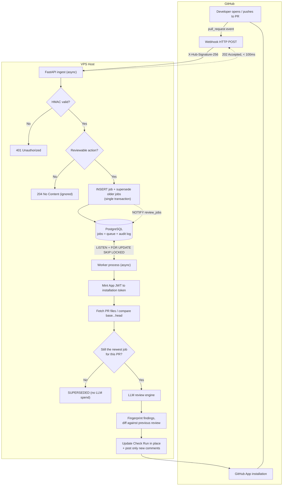
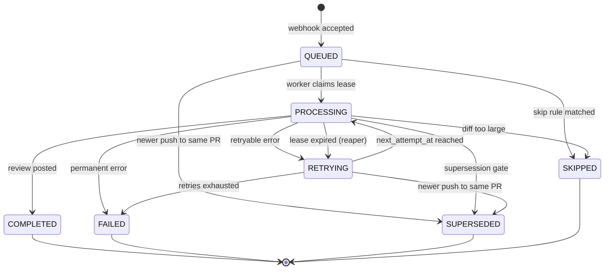

# System Architecture & Workflow Brief: PR Review Bot

An automated AI code-review bot hosted on a VPS. It reviews **pull requests**, and
re-reviews them on **every update to the PR head**. Delivered as a GitHub App.

**Committed design decisions** (see §10 for what is still open):

| Decision | Choice |
| :--- | :--- |
| Trigger | `pull_request` events — not `push` |
| Queue | PostgreSQL (`FOR UPDATE SKIP LOCKED`) — no Redis, no Celery |
| Runtime | Fully async: FastAPI + SQLAlchemy 2.0 async + asyncpg + httpx |
| Topology | Two processes: API (webhook ingest) and worker (review execution) |

---

## 1. High-Level Architecture



Redis is deliberately absent. The job table *is* the queue: enqueue is
transactional with the job row, there is one source of truth for job state, and a
lost message cannot leave an orphaned row. `LISTEN`/`NOTIFY` gives sub-second
pickup without hot-polling; a 5-second poll is the fallback so a missed
notification only costs latency, never correctness.

---

## 2. End-to-End Processing Workflow

### Step 1 — Event

GitHub delivers a `pull_request` event. Reviewable actions:

| Action | Meaning | Reviewed |
| :--- | :--- | :--- |
| `opened` | PR created | Yes |
| `synchronize` | **new commits pushed to the PR head** | Yes |
| `reopened` | PR reopened | Yes |
| `ready_for_review` | draft promoted | Yes |
| `edited`, `labeled`, `closed`, … | metadata only | No |

`synchronize` is the event that satisfies "every update to the same PR triggers a
review again". Note it also fires on force-push, where the new head may be an
*older* SHA — see §4.

There is no `ref` filter. That concept belonged to the previous push-based design
and does not apply here; the equivalent gate is the action filter above plus the
skip rules in §3.

### Step 2 — Ingestion & Security Validation

1. Read the **raw request body** (capped at 5 MB) before any JSON parsing.
2. Verify `X-Hub-Signature-256` with HMAC-SHA256 over that raw body, compared with
   `hmac.compare_digest` (constant-time).
3. On failure return **401** — not 200. A forged request is not a successful one.
4. Parse JSON, filter on `action`. Non-reviewable actions return **204**.

The signature must be computed over bytes exactly as received; re-serializing the
parsed JSON changes whitespace and key order and will not match.

### Step 3 — Enqueue (one transaction)

```sql
BEGIN;
  -- Cancel work that this push has made obsolete.
  UPDATE pr_review_jobs
     SET status = 'SUPERSEDED', finished_at = now()
   WHERE repo_id = $1 AND pr_number = $2
     AND status IN ('QUEUED', 'RETRYING', 'PROCESSING');

  INSERT INTO pr_review_jobs (id, delivery_id, installation_id, repo_id,
                              repo_full_name, pr_number, head_sha, base_sha,
                              event_action, status)
  VALUES (..., 'QUEUED')
  ON CONFLICT (delivery_id) DO NOTHING;

  NOTIFY review_jobs;
COMMIT;
```

Respond `202 Accepted` immediately. GitHub abandons a delivery after ~10 seconds;
this path does two indexed writes and no network I/O, so it stays well inside that
budget even under retry storms.

### Step 4 — Claim (worker)

One statement, so a crash between select and update is impossible:

```sql
UPDATE pr_review_jobs
   SET status = 'PROCESSING',
       locked_by = $1,
       locked_until = now() + interval '10 minutes',
       started_at = now()
 WHERE id = (
   SELECT id FROM pr_review_jobs
    WHERE status IN ('QUEUED', 'RETRYING')
      AND next_attempt_at <= now()
    ORDER BY next_attempt_at
    FOR UPDATE SKIP LOCKED
    LIMIT 1)
RETURNING *;
```

**The transaction commits here and the row lock is released.** The review then runs
outside any database transaction — holding a lock across an LLM call would pin a
connection for minutes and block the reaper. The `locked_until` lease, not the row
lock, is what protects the job for the duration of the work.

### Step 5 — Authenticate & fetch

* Mint a JWT (App ID + private key, ≤10 min expiry), exchange it for an
  **installation access token** scoped to `installation_id` from the job row. The
  job stores `installation_id` precisely so a retry hours later can re-authenticate
  from the database alone.
* Fetch the diff with `GET /repos/{owner}/{repo}/pulls/{number}/files` (paginated,
  GitHub caps this at 3000 files) or `GET /repos/{owner}/{repo}/compare/{base}...{head}`.
  Not `GET /commits/{sha}` — for a multi-commit PR that returns one commit's diff
  and reviews the wrong thing.
* Fork PRs need no special handling: the event and the comment target both live in
  the base repository, where the installation token already has write access.

### Step 6 — Supersession gate

Re-check `status` after fetching, immediately before the LLM call. If another push
arrived while the diff was downloading, the job is already `SUPERSEDED` — abort
before spending tokens.

### Step 7 — Review & feedback

See §5 for how repeat reviews avoid duplicate comments.

---

## 3. Skip Rules

Applied at ingest where possible, otherwise after the diff fetch. Each terminates
the job as `SKIPPED` with an `error_kind`, so skips are auditable rather than
silent:

| Rule | `error_kind` | Rationale |
| :--- | :--- | :--- |
| PR author is a bot (`sender.type == "Bot"`) | `skip_bot_author` | Loop prevention — the bot must never review its own commits |
| PR is a draft (unless `ready_for_review`) | `skip_draft` | Do not burn tokens on WIP |
| Changed files > N or diff bytes > M | `skip_diff_too_large` | Cost ceiling; degrade to a summary-only review |
| All paths match ignore globs (lockfiles, vendored, generated) | `skip_no_reviewable_files` | Signal-free input |

---

## 4. Idempotency — two layers

GitHub redelivers webhooks. Neither layer alone is sufficient.

**Layer 1 — `UNIQUE (delivery_id)`.** Automatic retries of a failed delivery reuse
the `X-GitHub-Delivery` GUID, so `ON CONFLICT DO NOTHING` collapses them. A
*manual* redelivery from the UI may carry a fresh GUID, which is why layer 2
exists.

**Layer 2 — soft check on `(repo_id, pr_number, head_sha)`.** Before enqueuing,
look for a recent `COMPLETED` job at the same head SHA and skip if one exists.

This pair is deliberately **not** a unique constraint on `(repo_id, pr_number,
head_sha)`. That constraint would be simpler, but it permanently blocks a
legitimate re-review after a force-push that returns the PR head to a previously
reviewed SHA — a real scenario when someone reverts a bad commit. Keeping layer 2
in application code makes it overridable (a manual re-run, a prompt change, a
model upgrade) at the cost of a race window between two simultaneous deliveries,
which layer 1 already covers for the common case. If a duplicate review does slip
through, §5 makes it harmless: the comment set is fingerprinted, so a repeat review
posts nothing.

---

## 5. Repeat Reviews Without Comment Spam

A PR reviewed five times must not carry five copies of the same finding.

**Primary output — a Check Run, updated in place.** The bot creates one Check Run
per PR and stores its `check_run_id` on the first job for that PR. Every subsequent
review `PATCH`es the same Check Run. This is idempotent by construction: re-running
a review overwrites the previous result instead of appending to it, and annotations
carry file/line anchoring natively (50 per request).

**Secondary output — fingerprinted inline comments.** Each finding gets a
`fingerprint`: `sha256(file_path + normalized_content + anchored_code_snippet)`.
Deliberately **not** including the line number — lines shift when unrelated code
above them changes, and a line-keyed fingerprint would re-post every finding in a
file after a one-line insertion at the top.

On each review:

1. Load fingerprints from the most recent `COMPLETED` job for this PR.
2. Post only findings whose fingerprint is new.
3. Persist each comment row with its `external_comment_id` and `posted_at`
   **as it is posted**, not in one batch at the end. A crash after posting but
   before persisting is the case that causes duplicate comments on retry.
4. Optionally minimise now-stale comments via the GraphQL `minimizeComment`
   mutation.

---

## 6. Failure Handling

Errors are classified, because a 404 and a 429 deserve opposite treatment:

| Class | Examples | Action |
| :--- | :--- | :--- |
| `retryable` | 429, 5xx, LLM timeout, connection reset | `RETRYING`, `next_attempt_at = now() + backoff(retry_count)`, jitter |
| `permanent` | 404 (PR deleted), 403 (app uninstalled), malformed diff | `FAILED` immediately — no retries |
| `exhausted` | `retry_count >= max_retries` | `FAILED`, alert |

**The reaper** recovers jobs whose worker died mid-flight — without it,
`retry_count` could never increment for the most common failure mode:

```sql
UPDATE pr_review_jobs
   SET status = 'RETRYING',
       retry_count = retry_count + 1,
       next_attempt_at = now() + interval '1 minute',
       locked_by = NULL, locked_until = NULL
 WHERE status = 'PROCESSING' AND locked_until < now();
```

Long-running reviews must **extend their lease** periodically, or the reaper will
reclaim a job that is still being worked on and duplicate it.

`FAILED` jobs are the dead-letter queue — they stay in the table with `error_kind`
and `error_log` for triage and manual re-run.

---

## 7. Job Lifecycle



Only the worker moves a job into `PROCESSING`, `COMPLETED`, `RETRYING` or `FAILED`.
Only the ingest path writes `SUPERSEDED`. Terminal states are never re-entered — a
re-run creates a new job rather than resurrecting an old one, which keeps the table
an append-mostly audit log.

---

## 8. VPS Infrastructure

| Component | Technology | Operational Strategy |
| :--- | :--- | :--- |
| Reverse proxy | Caddy (automatic TLS) or Nginx | HTTPS termination, rate limiting, request body cap |
| API process | `uvicorn` under systemd | Webhook ingest only; restart is safe at any moment |
| Worker process | separate systemd unit | Own event loop and engine, so API deploys never kill an in-flight review |
| Database | PostgreSQL 14+ | Job queue, audit log, comment fingerprints |
| Secrets | systemd `LoadCredential` or env file, mode `0600` | App private key never in the repo or image |

Two processes rather than one matters: with `BackgroundTasks` inside FastAPI, every
API restart would abandon running reviews.

Connection pooling: size the worker pool to worker concurrency, not to CPU count —
these connections are held only briefly, since the LLM call happens outside any
transaction.

---

## 9. Rate Limits & Cost

* **GitHub primary limit** scales with installation size (5,000–12,500 req/hr) and
  is rarely the constraint.
* **GitHub secondary limits** on content creation *are* the constraint for a
  commenting bot. Serialise comment posts per repository and honour
  `Retry-After`.
* **LLM provider limits and per-review cost** are the real bottleneck. Controls, in
  order of effect: supersession (§3 of the enqueue transaction), diff-size caps,
  per-repo concurrency limits, and a per-installation daily token budget.

---

## 10. Open Questions

1. **Draft PRs** — skip until `ready_for_review` (assumed above), or review them?
2. **Finding severity** — should `pr_review_comments` carry a severity so users can
   set a "comment only on high" threshold? Adding the column later is cheap; the
   modelling question is whether severity is LLM-assigned or rule-derived.
3. **Check Run conclusion** — does a review with findings ever `fail` the check
   (blocking merge), or is it always `neutral`/`success`?
4. **Retention** — job rows store repository paths and LLM output derived from
   customer source code. How long are they kept, and is there a purge on app
   uninstall?
