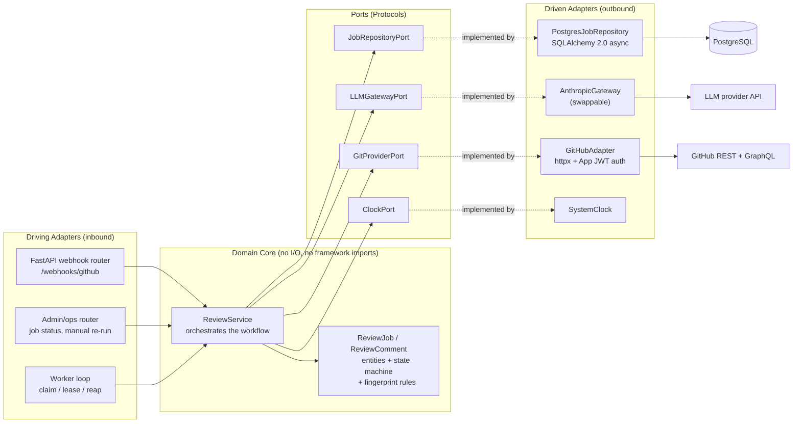
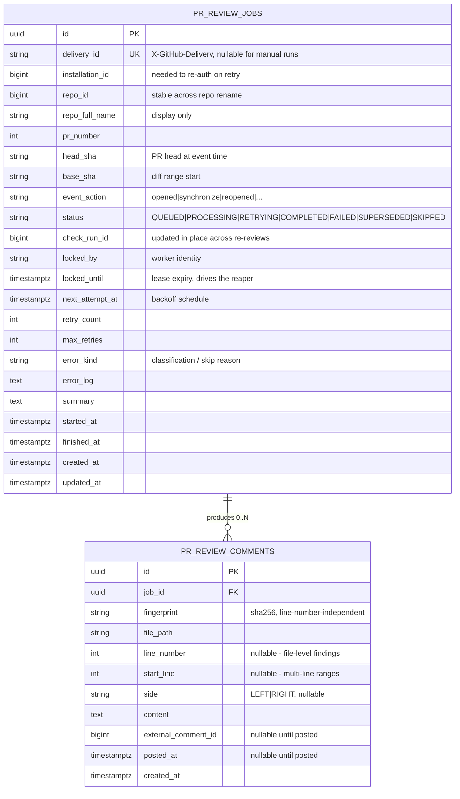

# Component & Entity Model

Two separate concerns, previously drawn as one diagram: the **component
architecture** (Hexagonal, ports and adapters — runtime collaborators, no cardinality) and the
**entity-relationship model** (persisted rows).

---

## 1. Component Architecture (Ports & Adapters)

**Notes on the shape**

* `GitProviderPort` now has an adapter. It was the only port drawn without one.
* `ClockPort` is added because the domain is saturated with time decisions — lease
  expiry, backoff, supersession windows. Injecting the clock is what makes those
  testable without `sleep` or `freezegun`.
* The **worker loop is a driving adapter**, not part of the domain. It decides
  *when* to ask for work; the service decides *what* the work is. This keeps
  "review a PR" callable from a test, a CLI, or an HTTP re-run endpoint without a
  worker running.
* Ports are `typing.Protocol` definitions owned by the domain package, not by the
  adapters. The dependency arrow must point inward: adapters import the domain, and
  the domain imports nothing from `adapters/`.

**Where the mapping layer lives.** `ReviewJobORM` (in `adapters/db/models.py`) is
*not* the domain entity. `PostgresJobRepository` translates between the two at its
boundary. This is the layer that decides whether ports-and-adapters pays off here
or degenerates into an anemic wrapper — if the domain `ReviewJob` never grows
behaviour beyond field access, the mapping is pure cost and the ORM model should be
used directly. The behaviour it is expected to own:

* `can_transition_to(status)` — the state machine in §7 of the workflow doc.
* `is_superseded_by(other)` — head-SHA and timestamp comparison.
* `next_backoff()` — retry delay from `retry_count`.
* `Finding.fingerprint()` — the hash rule, which must stay identical across
  releases or every stored comment de-duplicates against nothing.

---

## 2. Entity-Relationship Model

Only persisted state appears here.

### Why these fields exist

| Field | Reason |
| :--- | :--- |
| `installation_id` | Without it, a job replayed from the database cannot mint a token — the value exists only in the original webhook payload |
| `repo_id` | `repo_full_name` changes on rename or transfer; the numeric id does not |
| `base_sha` | A PR review diffs `base...head`; the head alone is not a diff |
| `check_run_id` | Makes the primary output idempotent across re-reviews |
| `locked_by` / `locked_until` | Lease-based recovery — a killed worker's job is reclaimable |
| `next_attempt_at` | `retry_count` alone cannot express *when* to retry |
| `error_kind` | Drives retryable-vs-permanent branching; free-text `error_log` cannot |
| `fingerprint` | The mechanism that stops re-reviews duplicating comments |
| `external_comment_id` / `posted_at` | Records that a comment reached GitHub, so a crash mid-post does not double-post on retry |
| `line_number` nullable | File-level and PR-level findings have no line |

### Cardinality

`PR_REVIEW_JOBS ||--o{ PR_REVIEW_COMMENTS` — zero-or-more, not one-or-more. A clean
review produces a job with no comments, and that is the expected outcome for most
PRs.

### Deliberately absent

* **No `pull_requests` table.** A PR is GitHub's entity, not ours; duplicating its
  state here creates a sync problem with no owner. "All reviews for PR #N" is a
  query on `(repo_id, pr_number)`, which is indexed.
* **No `repositories` table.** Same reasoning. Add one only when per-repo
  configuration (ignore globs, severity thresholds, budgets) becomes real — at
  which point it holds config, not mirrored GitHub state.
* **No raw payload column.** Storing full webhook bodies grows the table without
  bound; the extracted fields above cover replay. If debugging needs the original,
  it belongs in log storage with a retention policy, not in the hot table.
