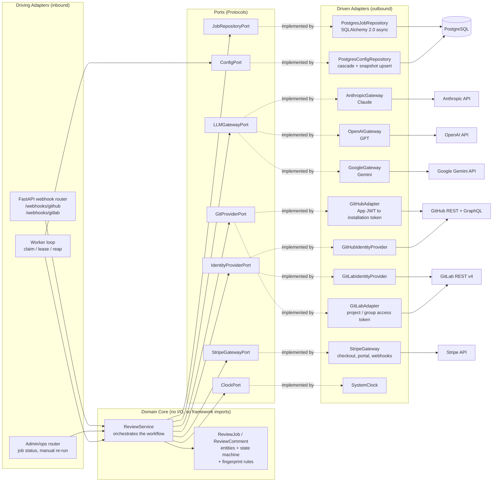
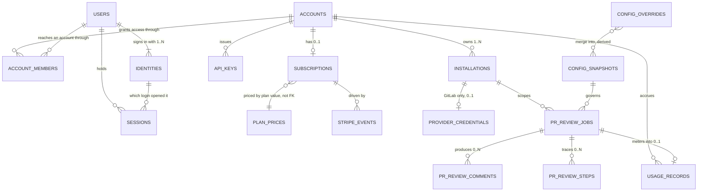

# Component & Entity Model

Two separate concerns, previously drawn as one diagram: the **component
architecture** (Hexagonal, ports and adapters — runtime collaborators, no cardinality) and the
**entity-relationship model** (persisted rows).

---

## 1. Component Architecture (Ports & Adapters)

**Notes on the shape**

* **Both ports are now multi-adapter, and that is the point of having them.** A
  port with one implementation is a hypothesis; a port with two is a tested
  boundary. What each must abstract:
  * `LLMGatewayPort` — the easy one. Three adapters over the same shape: take a
    prompt and a model name, return findings and a token count. The differences
    (message formats, streaming, tool syntax, token accounting) stay inside each
    adapter. `model` in config selects the adapter, so adding a fourth provider is
    an adapter plus a config value.
  * `GitProviderPort` — the hard one, because GitHub and GitLab disagree on more
    than naming. See the table below before assuming the port is thin.
  * `ConfigPort` is driven by the **worker loop**, not by `ReviewService`. Config
    is resolved once at claim, frozen, and passed down — so the service never
    re-reads it mid-review and cannot run one review under two different diff
    caps ([configuration.md §5](./configuration.md)).
  * `IdentityProviderPort` — deliberately *not* folded into `GitProviderPort`.
    They differ in credential and in reason to change: one acts as an
    installation against repositories, the other as a human against a login.
    Merging them would put OAuth state machines and diff fetching behind one
    interface with two lifecycles.
  * `StripeGatewayPort` — single-implementation, and deliberately so. Payment
    providers do not swap the way forges and models do: customer records will not
    transfer, so a switch is a once-in-years migration that an abstraction cannot
    make cheaper. The port exists only to keep the Stripe SDK out of the domain
    and to let entitlement and dunning logic be tested against a fake — the same
    justification as `ClockPort`, not the multi-adapter one.
* `ClockPort` is added because the domain is saturated with time decisions — lease
  expiry, backoff, supersession windows. Injecting the clock is what makes those
  testable without `sleep` or `freezegun`.
* The **worker loop is a driving adapter**, not part of the domain. It decides
  *when* to ask for work; the service decides *what* the work is. This keeps
  "review a PR" callable from a test, a CLI, or an HTTP re-run endpoint without a
  worker running.
* Ports are `typing.Protocol` definitions owned by the domain package, not by the
  adapters. The dependency arrow must point inward: adapters import the domain, and
  the domain imports nothing from `adapters/`.

**What `GitProviderPort` has to absorb.** GitLab is not GitHub with different
nouns; four of these are load-bearing:

| Concern | GitHub | GitLab |
| :--- | :--- | :--- |
| Unit of review | Pull Request | Merge Request |
| Webhook auth | HMAC-SHA256 over the raw body | `X-Gitlab-Token`, a plain shared secret compared constant-time — **no body signature at all** |
| Tenancy / auth | App install → JWT → installation token, 1h | Project or group access token, or OAuth app — no installation concept, no token exchange |
| Primary output | Check Run, updated in place, with annotations | Commit status plus MR notes — **no in-place annotated check to PATCH** |
| Comment identity | `author_association` on the comment | Project access level (Guest…Owner) |
| Delivery id | `X-GitHub-Delivery` | `X-Gitlab-Event-UUID` |

The first three are the ones that cost real design. Webhook auth means signature
verification is a driving-adapter concern, not one shared routine. Tenancy means
`installation_id` is a GitHub-shaped name for a provider-scoped credential
reference. And the output row is the significant one: the repeat-review strategy in
§5 of the workflow document is built on a Check Run being idempotent by
construction, which GitLab has no equivalent for — a GitLab adapter has to reach
the same "one review, updated in place" outcome by editing a single MR note, and
that is a behavioural difference the port cannot hide.

**Where the mapping layer lives.** `ReviewJobORM` (in `adapters/db/models.py`) is
*not* the domain entity. `PostgresJobRepository` translates between the two at its
boundary. This is the layer that decides whether ports-and-adapters pays off here
or degenerates into an anemic wrapper — if the domain `ReviewJob` never grows
behaviour beyond field access, the mapping is pure cost and the ORM model should be
used directly. The behaviour it is expected to own:

* `can_transition_to(status)` — the state machine in §7 of the workflow doc.
* `is_superseded_by(other)` — head-SHA and timestamp comparison.
* `next_backoff()` — retry delay from `retry_count`.
* `Finding.fingerprint()` — the hash rule, which must stay identical across
  releases or every stored comment de-duplicates against nothing.

---

## 2. Entity-Relationship Model

Every persisted table and how it connects. **Columns are deliberately absent** —
they live in [db_models_and_migrations.md §1](./db_models_and_migrations.md), and
keeping them in one place is what stops the two drifting. This diagram answers
"what relates to what"; that document answers "what is in it".

Two edges are **not** foreign keys and are drawn only because the dependency is
real: `SUBSCRIPTIONS → PLAN_PRICES` matches on the plan value, and
`SUBSCRIPTIONS → STRIPE_EVENTS` is the event stream that drives subscription
writes. `CONFIG_OVERRIDES → CONFIG_SNAPSHOTS` is derived rather than stored:
resolution merges up to three scope rows into one content-addressed revision, and
nothing materialises the many-to-many.

---

### Review domain

**`PR_REVIEW_JOBS`** — one row per review attempt, and the table the whole design
turns on: it is simultaneously the **work queue** and the **audit log**. Every
other decision follows from that dual role — partial indexes sized to in-flight
work rather than to history, a `locked_by`/`locked_until` lease pair so a killed
worker's job is reclaimable, and terminal rows that are never mutated again. A
re-run creates a new row rather than resurrecting an old one. Scoped by
`installation_id` rather than by provider, because an installation already knows
its forge and its credential. Carries `author_external_id` and a normalised
`author_association` so the owner can see whose pull requests spent the quota and
cap any one contributor — the review is billed to the account that connected the
repository, not to whoever opened the PR.

**`PR_REVIEW_COMMENTS`** — one row per finding, carrying the line-number-independent
`fingerprint` that stops a fifth review of a PR posting a fifth copy of every
comment. `external_comment_id` and `posted_at` are written **as each comment is
posted**, never batched, because a crash between posting and persisting is exactly
what causes duplicates on retry. Zero-or-more per job: a clean review produces no
comments, and that is the expected outcome for most PRs.

**`PR_REVIEW_STEPS`** — one row per pipeline stage per attempt, so a slow review
can be attributed rather than guessed at. Records **shape, never content**:
digests, counts and durations, no prompt, diff or response body. `attempt` mirrors
the job's `retry_count`, so a retry appends a fresh set of rows instead of
overwriting the failed one. Rows are inserted at step start and updated at finish,
because a step that hangs must still leave evidence. Retention is shorter than the
job's — this is debugging data, not audit — and billing never reads it.

### Configuration

**`CONFIG_OVERRIDES`** — the mutable, human-edited surface. One partial settings map
per scope (`GLOBAL`, `INSTALLATION`, `REPO`); an absent key inherits rather than
nulling the parent out.

**`CONFIG_SNAPSHOTS`** — immutable and content-addressed by `digest`, one
row per distinct *resolved* configuration. Thousands of jobs under an unchanged
policy share a single row, and a job's `config_digest` answers "which policy
produced this review?" without a join. It is an audit record and nothing more —
notably it does **not** take part in comment deduplication, so editing a setting
can never repost comments.

### Tenancy

**`ACCOUNTS`** — the billable tenant, and the unit every API query is scoped by.
Holds the Stripe customer reference once checkout has happened.

**`USERS`** — a person. `email` exists for notices only; it is never an identity
key and never a join condition, because auto-linking accounts by email is an
account-takeover path.

**`IDENTITIES`** — a forge login, unique per `(provider, provider_user_id)`. One
user has one or more: the same human may sign in through GitHub and GitLab, and
collapsing this into `users` would make them two people with two half-views of the
same data. A second identity may only be attached from an already-authenticated
session.

**`ACCOUNT_MEMBERS`** — the user-to-account join, carrying `role`. One row and one
role (`owner`) today; it stays a join table rather than a column on `accounts`
because re-expanding a column into a join later is the expensive direction.

**`INSTALLATIONS`** — one forge integration, belonging to exactly one account.
This is what makes every downstream identifier unambiguous, and why jobs reference
it rather than a raw forge id.

**`PROVIDER_CREDENTIALS`** — envelope-encrypted token, at most one per
installation, and **GitLab only**: GitHub derives short-lived tokens from our own
private key and needs nothing stored. The single sanctioned exception to "no
secrets in the database", with the key id recorded so KEKs can rotate.

### Billing

**`SUBSCRIPTIONS`** — a projection of Stripe, which owns the truth. Carries our
own five-state status rather than Stripe's wider vocabulary, plus `last_event_at`:
Stripe delivers events out of order, so a write applies only when the event is
newer, or a delayed update resurrects a cancelled plan.

**`PLAN_PRICES`** — plan to Stripe price id, so a price change is data rather than
a deploy.

**`STRIPE_EVENTS`** — webhook idempotency. `stripe_event_id` is unique, giving
at-least-once delivery the same `ON CONFLICT DO NOTHING` treatment as
`delivery_id` on jobs.

**`USAGE_RECORDS`** — one row per completed review, unique on `job_id` so a
retried metering write cannot bill the same review twice. Indexed by
`(account_id, period)` because the quota check is an aggregate over one account's
current window.

### Auth

**`SESSIONS`** — server-side rather than stateless, keyed by the hash of the
cookie value, so revocation is immediate. Records both the user and the identity
that opened it, keeping an audit trail when a person holds two logins.

**`API_KEYS`** — programmatic access, scoped to an account. Indexed by prefix for
lookup, with only a hash stored.

---

### Deliberately absent

* **No `pull_requests` table.** A PR is the forge's entity, not ours; duplicating
  its state creates a sync problem with no owner. "All reviews for PR #N" is a
  query on `(installation_id, repo_id, pr_number)`, served by
  `ix_pr_review_jobs_pr_history`.
* **No `repositories` table.** Same reasoning. Per-repo policy lives in
  `config_overrides` keyed by scope, which holds configuration rather than mirrored
  forge state.
* **No raw payload, diff or prompt storage.** It would grow without bound, and it
  would retain customer source — and any credential ever committed by accident —
  long after the customer believed it destroyed. The extracted fields cover replay;
  reproducibility is served by digests, not by copies.
* **No `teams` table.** One user per account today; organisations, teams and
  per-seat billing are explicit non-goals.
