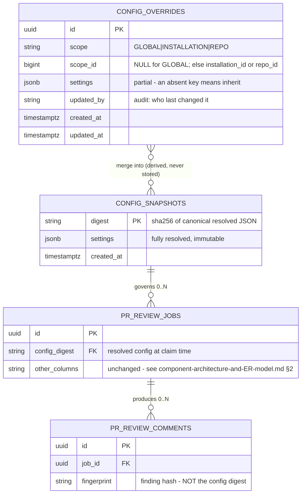

# Configuration

Runtime **policy** for the PR Review bot: what the bot reviews, how much context it
builds, what it spends, and what it posts. Stored in PostgreSQL so a knob can be
turned per repository without a redeploy.

**Never stored here:** the GitHub App private key, webhook secret, LLM API keys,
and `DATABASE_URL`. Those stay in systemd `LoadCredential` or a `0600` env file
([WORKFLOW_DESIGN.md §8](./WORKFLOW_DESIGN.md)) — a table that the admin API
can read is the wrong home for a signing key, and connection settings cannot come
from the connection they configure.

**Also not here:** `worker_concurrency` and `pool_size`. They size the engine at
startup ([db_models_and_migrations.md §2](./db_models_and_migrations.md)), so they
must exist before the pool does.

---

## 1. Schema

Two tables. `config_overrides` is the mutable, human-edited surface; each row is a
*partial* setting map for one scope. `config_snapshots` is immutable and
content-addressed — one row per distinct **resolved** config, created on demand and
shared by every job it governs.



Content-addressing is what keeps this cheap: thousands of jobs under an unchanged
config share one revision row, and `pr_review_jobs.config_digest` answers "which
policy produced this review?" without a join.

### Constraints

```sql
UNIQUE (scope, scope_id)
CHECK  (scope IN ('GLOBAL','INSTALLATION','REPO'))
CHECK  ((scope = 'GLOBAL') = (scope_id IS NULL))
CREATE UNIQUE INDEX uq_config_overrides_global
    ON config_overrides (scope) WHERE scope = 'GLOBAL';
```

The partial index is load-bearing. `UNIQUE (scope, scope_id)` alone permits any
number of `GLOBAL` rows, because PostgreSQL treats NULLs as distinct — the same
behaviour `delivery_id` relies on deliberately
([db_models_and_migrations.md §1](./db_models_and_migrations.md)), working against
us here. `UNIQUE NULLS NOT DISTINCT` would also do it, but that is PG 15+ and the
stated floor is PG 14.

### Naming

`pr_review_comments.fingerprint` hashes a *finding*. `config_digest` hashes a
*config*. Two different hashes over two different things; the column names must
not converge.

---

## 2. Resolution

`GLOBAL → INSTALLATION → REPO`, merged **key by key**, nearest scope winning. An
absent key inherits; it does not null the parent out. Whole-document precedence
was rejected: a repo overriding one glob would have to restate every setting, and
those copies would drift.

**Lists replace, they do not extend.** `ignore_globs` at REPO scope substitutes the
installation list rather than appending to it. Extending is what people usually
expect, so the default set is repeated in the docs for anyone overriding it.

**Every key carries a maximum settable scope** (§3), enforced in the Pydantic model
at the `ConfigPort` boundary — not in the database. Some knobs are unsafe to
delegate: a repo that raises its own `daily_token_budget` is spending our money.

**Resolved at claim, not at enqueue.** A job queued for an hour runs under the
policy current when a worker picks it up. Latest policy wins; a config fix does not
have to wait out the backlog it was meant to fix.

---

## 3. Settings

`Scope` = the most local level at which the key may be set. `Inval.` = changing it
re-posts existing comments (see §4).

| Stage | Key | Default | Scope | Inval. |
| :--- | :--- | :--- | :--- | :--- |
| Ingest | `enabled` | `true` | REPO | — |
| Ingest | `trigger_actions` | `[opened, synchronize, reopened, ready_for_review]` | REPO | — |
| Ingest | `review_drafts` | `false` | REPO | — |
| Ingest | `skip_label` | `"no-review"` | REPO | — |
| Ingest | `target_branches` | `["*"]` | REPO | — |
| Author | `review_fork_prs` | `true` | REPO | — |
| Author | `min_author_association` | `"NONE"` | REPO | — |
| Author | `max_reviews_per_author_per_day` | `10` | REPO | — |
| Skip §3 | `max_changed_files` | `100` | REPO | — |
| Skip §3 | `max_diff_bytes` | `1048576` | REPO | — |
| Skip §3 | `ignore_globs` | lockfiles, vendored, generated | REPO | — |
| Skip §3 | `on_too_large` | `"summarize"` | REPO | — |
| Context | `lines_before` | `30` | REPO | likely |
| Context | `lines_after` | `30` | REPO | likely |
| Context | `expand_to_enclosing_scope` | `false` | REPO | likely |
| Context | `whole_file_under_lines` | `200` | REPO | likely |
| Context | `max_total_context_tokens` | `60000` | INSTALLATION | likely |
| Context | `include_pr_description` | `true` | REPO | likely |
| Context | `include_prior_comments` | `true` | REPO | likely |
| Context | `truncation_strategy` | `"drop_files"` | REPO | likely |
| Redaction | `redaction_rules_version` | `"2026.09"` | GLOBAL | yes |
| Redaction | `post_secret_findings` | `true` | REPO | — |
| LLM | `llm_provider` | `"anthropic"` | INSTALLATION | yes |
| LLM | `model` | `"claude-sonnet-5"` | INSTALLATION | yes |
| LLM | `prompt_version` | `"v1"` | GLOBAL | yes |
| LLM | `temperature` | `0.0` | GLOBAL | yes |
| LLM | `focus_areas` | `[correctness, security]` | REPO | yes |
| LLM | `house_rules` | `""` | REPO | yes |
| Output §5 | `min_severity` | `"medium"` | REPO | — |
| Budget §9 | `max_reviews_per_pr` | `20` | REPO | — |
| Output §5 | `max_comments_per_review` | `25` | REPO | — |
| Output §5 | `check_conclusion` | `"neutral"` | REPO | — |
| Output §5 | `minimize_stale` | `true` | REPO | — |
| Queue | `max_retries` | `3` | INSTALLATION | — |
| Queue | `lease_seconds` | `600` | GLOBAL | — |
| Budget §9 | `daily_token_budget` | `1000000` | GLOBAL | — |
| Budget §9 | `quota_soft_buffer_pct` | `10` | GLOBAL | — |
| Budget §9 | `max_concurrent_per_repo` | `2` | INSTALLATION | — |
| Retention | `job_retention_days` | `30` | GLOBAL | — |
| Retention | `trace_retention_days` | `14` | GLOBAL | — |
| Retention | `stripe_event_retention_days` | `30` | GLOBAL | — |
| Retention | `purge_on_uninstall` | `true` | GLOBAL | — |

Note the diff cap already exists as a skip rule; making it config does not change
the §3 contract, only where the number comes from.

`max_comments_per_review` is new. Fingerprinting stops *repeat* spam across
reviews; nothing otherwise stops a first review of a 40-file PR posting 200
comments.

The three `Author` keys exist because **a review is billed to the account that
connected the repository, never to the contributor who opened the PR** — outside
contributors have no billing relationship with us. `max_reviews_per_author_per_day`
is the one that matters: without it a stranger opening fifty PRs against a public
repository drains the owner's monthly quota, and no other control stops them.
Defaults are permissive, because the common case is a repository whose
contributors are all welcome.

**`min_severity` is a threshold, exactly like a log level.** The model labels each
finding `low`, `medium`, `high` or `critical`; the key says how loud you want the
bot. `medium` by default; `critical` for a repository where only real danger is
worth interrupting anyone. Severity is never stored — it is a filter applied
before posting, the way a logger drops `DEBUG` rather than writing it somewhere
first. The distribution is kept as a histogram on the `POSTPROCESS` trace row,
which answers "how noisy is the model" without a column on a comment.

**`max_reviews_per_pr` bounds what per-PR billing exposes.** Quota counts distinct
pull requests, so every re-review after the first is free to the customer and not
free to us. This caps how far that goes on one pathological PR.

Redaction itself is **not** a switch. Only the rule-set version and whether a
detected secret is posted as a finding are configurable — turning the redactor off
would let credentials reach a third-party model, and that is not a per-repo
decision. The version is fingerprint-invalidating because changing the rules
changes what the model sees.

`job_retention_days` is **30**, not longer, because the product value of a
four-month-old review is close to zero and "review content is deleted within 30
days" is a commitment worth being able to make. `usage_records` is exempt from the
purge entirely — it is the billing trail, and accounting outlives reviews.

`trace_retention_days` is deliberately far shorter than `job_retention_days`:
`pr_review_jobs` is the audit log, `pr_review_steps` is debugging data whose value
collapses within a fortnight. `stripe_event_retention_days` can be shorter still —
the rows exist only to collapse redelivered webhooks, and Stripe stops retrying an
event long before thirty days.

Expired `sessions` need no key: `expires_at` already states the policy, and the
purge simply deletes rows past it.

---

## 4. Config changes and fingerprints

The finding fingerprint is `sha256(file_path + normalized_content + snippet)`
([WORKFLOW_DESIGN.md §5](./WORKFLOW_DESIGN.md)). Config reaches it through
two channels, and they need different treatment.

**Mechanical — eliminate it.** If `snippet` were cut from the context window, then
raising `lines_before` from 30 to 50 would change every fingerprint in the fleet
and re-post every comment on every open PR. So the fingerprint snippet is **pinned
at 3 lines centred on the finding**, defined independently of the context builder.
Two windows for two purposes: a wide one for the model, a fixed narrow one for the
hash. This is the same argument that already excludes line numbers.

**Probabilistic — accept and detect it.** More context changes how the model
*words* a finding, which changes `normalized_content`, which changes the hash.
Pinning the snippet cannot prevent this, which is why context keys are marked
`likely` rather than `no` above.

**Config is deliberately *not* part of the dedupe lookup.** That lookup stays:

> the most recent `COMPLETED` job for this PR

An earlier draft filtered it on matching `config_digest`, so that a config change
would start a fresh comment baseline. That was withdrawn because it cannot help
and can only hurt. Trace it: review 1 posts findings hashing to `h1, h2, h3`; the
model changes; review 2 finds the same three bugs, reworded.

| | Dedupe finds | Comments posted | Duplicates |
| :--- | :--- | :--- | :--- |
| Filtered on `config_digest` | nothing — the digest differs | all of them | **the lot** |
| Unfiltered | `{h1, h2, h3}` | only the hashes that changed | **0 to 3** |

When rewording changes every hash, both post everything and the outcomes are
identical. When the model happens to phrase some findings the same way, the filter
discards matches the unfiltered lookup would have caught. It never posts fewer
comments, so it earns nothing.

The confusion it came from is worth naming: **idempotency layer 2**
([WORKFLOW_DESIGN.md §4](./WORKFLOW_DESIGN.md)) decides whether to *enqueue a
job*; deduping decides whether to *post a comment*. A config change is a reason to
re-run a review, which is layer 2's business and is available explicitly through
`POST /jobs/{id}/rerun`. It is not a reason to repost comments the reader has
already seen.

So editing a severity threshold, a rate limit or an author rule cannot disturb any
existing comment — config no longer participates in that decision at all.

**Filtered findings must not enter the dedupe set.** `min_severity` and
`max_comments_per_review` drop findings *after* generation. Recording their
fingerprints would mean that lowering the threshold later posts nothing, because
the suppressed findings already look like they were seen. The dedupe query loads
`WHERE posted_at IS NOT NULL` — which the schema already supports, since
`external_comment_id` and `posted_at` are written per comment as it is posted.

---

## 5. Reading config

* **Ingest** reads only the `enabled` / `trigger_actions` / `review_drafts` /
  `skip_label` / `target_branches` subset, from cache. The webhook path keeps its
  no-network-I/O budget; everything else is worker-side.
* **Worker** resolves the full config once at claim, upserts the revision row,
  writes `config_digest` onto the job, and passes a **frozen domain object** down
  the call chain. `ReviewService` never re-reads config mid-review — otherwise a
  single review could run under two different diff caps.
* **Cache:** 60-second TTL per scope key. `LISTEN`/`NOTIFY` was considered and
  rejected: only the worker holds a listen connection today, so the API process
  would need a new dedicated one outside the pool
  ([db_models_and_migrations.md §6](./db_models_and_migrations.md)) — real cost for
  a value that changes a few times a month and is never urgent.
* **Port:** `ConfigPort` in `domain/ports.py`, `PostgresConfigRepository` in
  `adapters/db/`. Validation lives at that boundary, so nothing downstream ever
  touches `settings` as raw JSON.

---

## 6. Why JSONB

Typed columns would give real CHECK constraints and self-documenting DDL, but every
new knob becomes a migration, and the knob set is not stable yet — `min_severity`
above is still an open question. The cost of JSONB is that a misspelled key
silently becomes a default instead of an error; the Pydantic model at the
`ConfigPort` boundary is what buys that back, and it only works if the rule in §5
holds.

---

## 7. Effect on the open questions

Three of the four once listed in [WORKFLOW_DESIGN.md §10](./WORKFLOW_DESIGN.md) stop
being decisions once they are keys — pick a default, let repositories disagree:
draft PRs (`review_drafts`), severity (`min_severity`), Check Run conclusion
(`check_conclusion`). Retention stays a real policy question; only its duration
becomes a knob.

Still open here:

1. **Source of truth.** This document assumes the table. The GitHub-native
   alternative is `.github/reviewbot.yml` in the repository, with the table as its
   parsed cache — config reviewed through PRs like any other code. The schema above
   works either way; the difference is whether the admin API writes it or the
   worker refreshes it from the repo.
2. **List semantics.** §2 commits to replace-not-extend. Revisit if the default
   `ignore_globs` set turns out to be something nobody wants to restate.
3. **Revision garbage collection.** Revision rows are immutable and shared, so they
   are only collectable once no job references them — which is really a question
   about `job_retention_days`, not about config.
